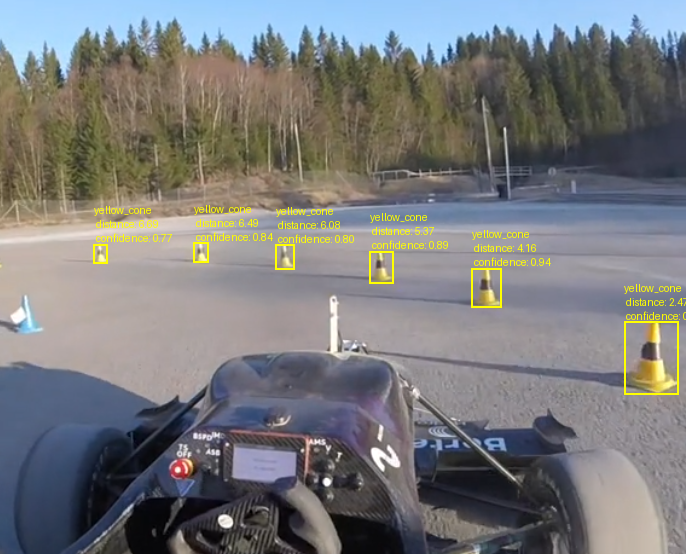

# Formula Student cones detection and depth estimation on monovision
<!--  -->

## TODO:
- [ ] Testing model on ONNX format
- [ ] Writing inference mode on TensorRT
- [ ] Create full README.md
- [ ] Add tracking algorithm (m.b. [StrongSort](https://github.com/dyhBUPT/StrongSORT?tab=readme-ov-file))